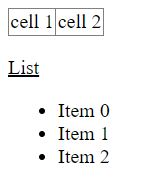

# Getting Started

## Overview

`htmlobj` allows you to create HTML using nothing but Python code.  It is an alternative to using templates with some other language, as used in many web frameworks.  Just create the HTML objects directly in code, and return the `str` representation to the web engine.

Using Python `with` statements to build the htmlobj objects allows you to easily see the HTML structure, and add in any Python code you need. When complete, the `str` value of the object will return HTML text.

Here is a brief example:

```python
from htmlobj import HTML
h = HTML()
with h.table(border="1", style="border-collapse:collapse"):
    with h.tr:
        h.td("cell 1")
        h.td("cell 2")
h.p.u("List")
with h.ul:
    for i in range(3):
        h.li(f"Item {i}")
print(h)
-> '<table><tr><td>cell 1</td>...'
```

When rendered in a browser, the result will look something like:



See the simple_page.py example in the source code for a more detailed version of the above, with more complex cell contents, links, and more attributes like CSS class and styles added.

Here is another example noting a few extra points:

```python
h = HTML("html")  # can pass root tag to HTML()
h.head.title("My Page")  # chain tags if only 1 subitem
with h.body:  # use `with` for multiple subitems
    h.p.u("Paragraph 1 underlined")
    h.p.b("Paragraph 2 bold")
```

## Installing

Install `htmlobj` using `pip`:

```
pip install htmlobj
```

Constructing your HTML
----------------------

To construct HTML start with an instance of ``htmlobj.HTML()``. Add
tags by accessing the tag's attribute on that object. 

For example:

```python
>>> from htmlobj import HTML
>>> h = HTML()
>>> h.p('Hello, world!')
>>> print(h)
<p>Hello, world!</p>
```

You may supply a tag name and some text contents when creating a HTML
instance:

```python
>>> h = HTML('html', 'text')
>>> print(h)
<html>text</html>
```

You may also append text content later using the tag's ``.text()`` method
or using augmented addition ``+=``. Any HTML-specific characters (``<>&"``)
in the text will be escaped for HTML safety as appropriate unless
``escape=False`` is passed. Each of the following examples uses a new
``HTML`` instance:

```python
>>> p = h.p('hello world!\\n')
>>> p.br
>>> p.text('more &rarr; text', escape=False)
>>> p += ' ... augmented'
>>> h.p
>>> print(h)
<p>hello, world!<br>more &rarr; text ... augmented</p>
<p>
```

Note also that the top-level ``HTML`` object adds newlines between tags by
default. Finally in the above you'll see an empty paragraph tag - tags with
no contents get no closing tag.

If the tag should have sub-tags, use a `with` context:

```python
>>> with h.ol as l:
...   l.li('item 1')
...   l.li.b('item 2 > 1')
```

You may turn off/on adding newlines by passing ``newlines=False`` or
``True`` to the tag (or ``HTML`` instance) at creation time:

```python
>>> l = h.ol(newlines=False)
>>> l.li('item 1')
>>> l.li('item 2')
>>> print(h)
<ol><li>item 1</li><li>item 2</li></ol>
```

Since we can't use ``class`` as a keyword, the library recognises ``klass``
or ``class_`` as a substitute:

```python
>>> print(h.p(content, klass="styled")) # or print(h.p(content, class_="styled"))
<p class="styled">content</p>
```

How generation works
--------------------

The HTML document is generated when the ``HTML`` instance is "stringified".
This could be done either by invoking ``str()`` on it, or just printing it.
It may also be returned directly as the "iterable content" from a WSGI app
function.

You may also render any tag or sub-tag at any time by stringifying it.

Tags with no contents (either text or sub-tags) will have no closing tag.
There is no "special list" of tags that must always have closing tags, so
if you need to force a closing tag you'll need to provide some content,
even if it's just a single space character.

Rendering doesn't affect the HTML document's state, so you can add to or
otherwise manipulate the HTML after you've stringified it.


Creating XHTML
--------------

To construct XHTML start with an instance of ``htmlobj.XHTML()`` and use it
as you would an ``HTML`` instance. Empty elements will now be rendered
with the appropriate XHTML minimized tag syntax. For example:

```python
>>> from htmlobj import XHTML
>>> h = XHTML()
>>> h.p
>>> h.br
>>> print(h)
<p></p>
<br />
```

Creating XML
------------

A slight tweak to the ``htmlobj.XHTML()`` implementation allows us to generate
arbitrary XML using ``htmlobj.XML()``:

```python
>>> from htmlobj import XML
>>> h = XML('xml')
>>> h.p
>>> h.br('hi there')
>>> print(h)
<xml>
<p />
<br>hi there</br>
</xml>
```

Tags with difficult names
-------------------------

If your tag name isn't a valid Python identifier name, or if it's called
"text" or "raw_text" you can add your tag slightly more manually:

```python
>>> from htmlobj import XML
>>> h = XML('xml')
>>> h += XML('some-tag', 'some text')
>>> h += XML('text', 'some text')
>>> print(h)
<xml>
<some-tag>some text</some-tag>
<text>some text</text>
</xml>
```